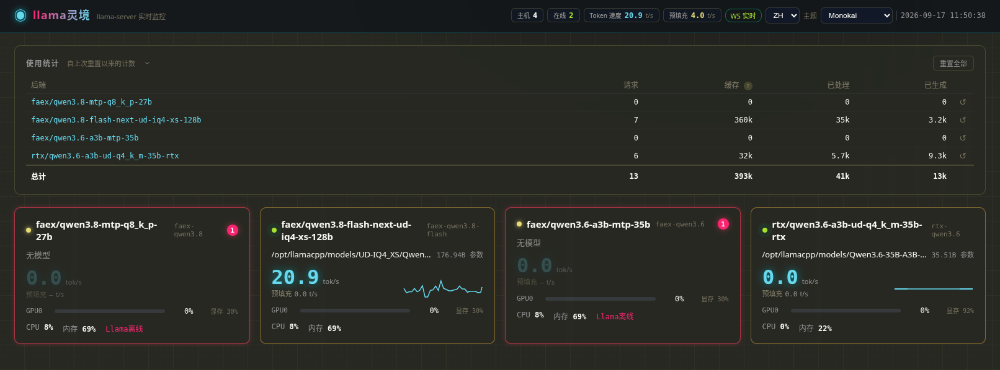

# 🚀 LlamaLens（llama灵境）— llama.cpp 实时监控面板

> 为 llama.cpp `llama-server` 而生的多主机实时监控：token 速度 / GPU / 上下文 / MTP 接受率，80+ 指标每秒推送。Docker 两行命令上线，对被监控主机零 agent、只读采集。

[](https://github.com/vaimr/llama-lens/stargazers)
[](https://github.com/vaimr/llama-lens/commits)
[](https://www.python.org/)
[](https://vuejs.org/)
[](cli/)
[](Dockerfile)

[](docs/README.en.md) [](docs/README.ru.md)

- **门户页**：所有主机状态一览（状态/模型/token 速度/GPU/CPU/内存）
- **单主机详情**：token 速度 / GPU 按卡聚合 / CPU（每核）/ 内存 / 磁盘 / 网络 / 进程 / 模型 / Slot / 事件流，80+ 数据项
- **实时**：WebSocket 1s 推送（可配置 1s/2s/5s/暂停），断线自动降级轮询
- **阈值飘红**：黄/红两级色阶，可按主机配置
- **9 套主题**：Aurora / Terminal / Light / Monokai / Nord / Dracula / Synthwave '84 / Tokyo Night / Matrix
- **双语界面**：English / Русский，右上角语言切换
- **部署**：原生单进程或 Docker 镜像，二选一

## ⭐ 为什么值得一个 Star

- **顶替一整套 Prometheus + Grafana** —— 单进程 / 单 Docker 容器开箱即用，专为 llama.cpp 调优
- **llama.cpp 原生指标** —— token 生成/预填充速度、上下文占用、MTP 接受率、Slot 状态，通用监控给不了
- **30 秒上线** —— `docker compose up -d --build`，打开浏览器即见实时面板
- **零侵入** —— 对被监控主机只执行只读命令：不装 agent、不写任何文件
- **附赠本机 TUI** —— `llamalens` 单二进制约 8 MB、零依赖，SSH 登录即可看实时状态
- **活跃开发** —— v1.2.0（2026-09-17）已发布，持续迭代

如果它帮到了你，一颗 ⭐ 能让更多人发现这个项目。

## 📸 界面截图

门户页（中文界面）：




## 当前状态

✅ **v1.0.0**（2026-08-29）—— 首个发布版本。后端（FastAPI + SSH/HTTP 采集 + WS 推送）与前端（Vue 3 + ECharts）均已完成，
`frontend/dist` 已构建，`./run.sh` 可直接启动。

✅ **Docker 镜像部署**（2026-08-30）—— 多阶段 Dockerfile + docker-compose，凭证运行时挂载，内置健康检查。

✅ **v1.1.0**（2026-09-01）—— 本地 CLI（llamalens TUI）+ 离线部署包 + 稳定性优化，详见「版本记录」。

✅ **v1.2.0**（2026-09-17）—— 三语 README 刷新：新首屏结构、徽章、对比表、本地化门户截图。

## 文档索引

| 文档 | 说明 |
|---|---|
| [README.md](README.md) | 中文主文档 |
| [docs/README.en.md](docs/README.en.md) | 英文主文档 |
| [docs/README.ru.md](docs/README.ru.md) | 俄文主文档 |
| 需求基线 | [01-需求文档](docs/01-需求文档.md) | 需求基线（后续开发主依据） |
|  | [EN](docs/01-requirements.en.md) · [RU](docs/01-требования.ru.md) | 需求基线翻译 |
| 架构设计 | [02-架构设计文档](docs/02-架构设计文档.md) | 架构、采集、数据模型、API、部署 |
|  | [EN](docs/02-architecture.en.md) · [RU](docs/02-архитектура.ru.md) | 架构设计翻译 |
| UI 与交互 | [03-UI与交互设计文档](docs/03-UI与交互设计文档.md) | 视觉规范、页面布局、组件、交互 |
|  | [EN](docs/03-ui-and-interaction.en.md) · [RU](docs/03-ui-и-взаимодействие.ru.md) | UI 交互设计翻译 |

## 技术栈

- 后端：Python 3.9+ + FastAPI + uvicorn + paramiko（SSH 只读采集）
- 前端：Vue 3 + Vite + ECharts 5 + Vue Router
- 部署：单进程 :8000（FastAPI 托管前端构建产物），支持原生 / Docker

## 监控对象（首台主机）

- ai.lan — Qwen3.8-27B-Q6_K（27.32B）· 双 RTX 3080 · llama-server :8080
- 详见 01-需求文档.md 附录 A

## 环境要求

| 项 | 要求 | 说明 |
|---|---|---|
| Python | 3.9+ | 原生部署（后端运行时） |
| Node.js | 18+ | 仅前端构建需要（Docker 部署或已有 dist 时不需要） |
| Docker | 20.10+（含 compose v2） | Docker 部署（可选） |
| 网络 | 面板 → 各主机 | llama HTTP 端口（默认 8080）与 SSH 端口（默认 22）可达 |

> 面板对被监控主机只做**只读**采集：llama-server HTTP 轮询 + SSH 只读命令（ps/df/nvidia-smi/journalctl 等），不写入被监控主机。

## ⚡ 快速开始（30 秒出结果）

### 方式一：原生部署

```bash
cp config/hosts.example.yaml config/hosts.yaml   # 填写主机信息
cp .env.example .env                              # 填写 SSH 密码
pip3 install -r backend/requirements.txt
cd frontend && npm install && npm run build       # 构建前端（已有 dist 可跳过）
cd .. && ./run.sh                                 # http://<本机>:8000
```

### 方式二：Docker 部署（推荐）

```bash
cp config/hosts.example.yaml config/hosts.yaml   # 填写主机信息
cp .env.example .env                              # 填写 SSH 密码
docker compose up -d --build                      # http://<主机>:8000
```

详细步骤见下文[使用教程](#使用教程)（含被监控主机的 systemd 配置）。

## 🆚 与替代方案对比

| | LlamaLens | Prometheus + Grafana | nvtop / nvidia-smi | 手写 curl /slots |
|---|:---:|:---:|:---:|:---:|
| llama.cpp 专属指标（token 速度 / MTP / Slot / 上下文） | ✅ 内置 | ❌ 需自建 exporter | ❌ | 自行解析 |
| 部署成本 | 单容器 / 单进程 | Prometheus + Grafana + exporter | 单二进制 | — |
| 被监控主机需装 agent | ❌ 不需要（SSH 只读） | ✅ 需 node_exporter 等 | 仅本机 | — |
| 秒级实时推送 | ✅ WebSocket 1s | 抓取粒度通常 ≥5s | 手动刷新 | 手动 |
| 阈值两级告警着色 | ✅ | 需配置 Alertmanager | ❌ | ❌ |
| 无浏览器本机 TUI | ✅ 零依赖单二进制 | ❌ | ✅ | ❌ |
| 9 主题 / 3 语言界面 | ✅ | ❌ | ❌ | ❌ |

## 使用教程

### 1. 配置

#### 1.1 `.env` —— 凭证

```bash
cp .env.example .env
```

| 变量 | 必填 | 说明 |
|---|---|---|
| `AI_SSH_PASS` | 是（示例名） | SSH 密码，在 hosts.yaml 中以 `${AI_SSH_PASS}` 引用。变量名可任意，与 hosts.yaml 中的引用一致即可 |
| `PORT` | 否 | 面板端口，默认 8000 |

`.env` 与 `config/hosts.yaml` 含敏感信息，已被 `.gitignore` 排除，勿提交。

#### 1.2 `config/hosts.yaml` —— 主机拓扑

```bash
cp config/hosts.example.yaml config/hosts.yaml
```

**global（全局）**

| 字段 | 默认 | 说明 |
|---|---|---|
| `push_interval` | 1.0 | WS 推送间隔（秒） |
| `history.llama_points` | 3600 | llama 序列环形缓冲点数（@1s，3600 = 1h） |
| `history.host_points` | 1800 | host 序列环形缓冲点数（@2s，1800 = 1h） |
| `thresholds` | — | 全局阈值覆盖（可选，见 1.4） |

**hosts[]（每主机）**

| 字段 | 必填 | 说明 |
|---|---|---|
| `id` | 是 | 唯一标识，用于 URL `/host/<id>` |
| `name` | 是 | 显示名称 |
| `llama.host` / `llama.port` | 是 | llama-server 地址（支持 IPv6 字面量） |
| `llama.path` | 否 | llama-server URL 前缀（反向代理场景），默认空 = `http://host:port/v1/models` |
| `llama.interval` | 否 | /health + /slots 轮询间隔（秒），默认 1.0 |
| `llama.slow_interval` | 否 | /props + /v1/models 轮询间隔（秒），默认 30.0 |
| `llama.timeout` | 否 | 单次请求超时（秒），默认 3.0 |
| `ssh.host` / `ssh.port` / `ssh.user` | 是 | SSH 连接信息 |
| `ssh.password` | 二选一 | 密码，支持 `${ENV_VAR}` 引用 .env 中的变量 |
| `ssh.key_path` | 二选一 | 密钥文件路径（与 password 二选一，支持 `~` 展开） |
| `ssh.interval` | 否 | 批量只读命令间隔（秒），默认 2.0 |
| `ssh.keepalive` / `ssh.timeout` | 否 | keepalive 15s / 单条命令超时 15s |
| `process.name` | 否 | 进程名（pgrep -x），默认 llama-server |
| `systemd_unit` | 否 | systemd unit 名，默认 llama-server.service |
| `log.source` | 否 | `journal`（systemd）或 `file`（日志文件） |
| `log.unit` | 否 | unit 名（source=journal 时生效），默认 llama-server |
| `log.path` | 条件 | 日志文件路径（source=file 时必填） |
| `log.follow` | 否 | 流式跟随；false 时改为 2s 周期拉取 |
| `log.catchup_sec` | 否 | 重连后补拉秒数（file 模式重连补拉 200 行） |
| `disk_mounts` | 否 | 监控的挂载点（df 采集），默认 ["/"] |
| `thresholds` | 否 | 每主机阈值覆盖（见 1.4） |

最小示例（单主机）：

```yaml
hosts:
  - id: ai
    name: AI 主机 (ai.lan)
    llama: { host: ai.lan, port: 8080 }
    # path: v1/llama        # 可选 URL 前缀
    ssh:
      host: ai.lan
      user: root
      password: ${AI_SSH_PASS}
    log:
      source: journal
      unit: llama-server
```

#### 1.3 增删主机

在 `hosts.yaml` 的 `hosts` 列表中增删条目，然后重启服务（原生：重跑 `./run.sh`；Docker：`docker compose restart`）。无需改代码。
每台主机独立监控：一台故障不影响其他主机与面板自身。

#### 1.4 阈值配置（飘红）

两级色阶：黄（warn）/ 红（danger）。默认阈值表：

| 指标 | warn | danger | 方向 |
|---|---|---|---|
| gpu_util（GPU 利用率） | 80 | 90 | 高于告警 |
| gpu_mem（显存） | 85 | 95 | 高于告警 |
| gpu_temp（GPU 温度） | 75 | 85 | 高于告警 |
| gpu_power（GPU 功耗） | 85 | 95 | 高于告警 |
| cpu | 80 | 90 | 高于告警 |
| mem（内存） | 85 | 95 | 高于告警 |
| disk（磁盘） | 80 | 90 | 高于告警 |
| ctx（上下文占用） | 80 | 90 | 高于告警 |
| mtp（MTP 接受率） | 80 | 65 | **低于**告警 |

覆盖方式（全局或每主机，逐字段合并，未覆盖字段用默认值）：

```yaml
global:
  thresholds:
    gpu_util: { warn: 70, danger: 85 }
hosts:
  - id: ai
    thresholds:
      mtp: { warn: 75, danger: 60 }
```

### 2. 准备被监控主机（llama-server systemd 配置）

面板对被监控主机的采集走三条通道（全部只读），主机侧满足对应条件才能被完整采集：

| 通道 | 采集内容 | 主机侧条件 |
|---|---|---|
| llama-server HTTP API（`llama.host:llama.port`，默认 8080） | `/slots`（1s）、`/props`、`/v1/models`（30s）：在线状态、Slot、上下文、模型信息 | llama-server 监听面板可达的地址:端口 |
| SSH 批量只读命令（2s） | CPU/内存/磁盘/网络/GPU/进程，`systemctl show <unit>` 服务状态 | SSH 可达；进程名 = `process.name`；unit 名 = `systemd_unit` |
| SSH journal 流（`journalctl -u <unit> -f`） | 实时任务状态、token 速度、MTP 接受率、上下文占用 | 日志进 systemd journal（默认行为）；unit 名 = `log.unit` |

**四个硬性条件（均可通过 hosts.yaml 配置适配，以下为默认值）**

1. **进程名与 `process.name` 一致**（默认 `llama-server`）：SSH 采集用 `pgrep -x` 精确匹配；进程名超过 15 字符时（内核把 comm 截断到 15 字符）自动回退 cmdline argv[0] basename 匹配，直接设全名即可。二进制不叫 `llama-server`（如 `llama-server-turbo`）时无需改名，在 hosts.yaml 设 `process.name: llama-server-turbo` 即可。
2. **systemd unit 名与配置一致**：`systemd_unit`（默认 `llama-server.service`，供 `systemctl show` 采集服务状态）与 `log.unit`（默认 `llama-server`，供 `journalctl -u` 采集日志）。unit 不叫 `llama-server.service`（如 `my-llama.service`）时，把这两个字段同步改为实际 unit 名。
3. **llama-server 监听面板可达的地址:端口**：面板跨主机直连 API，需 `--host 0.0.0.0 --port 8080`（或面板可达的网卡地址），与 hosts.yaml 的 `llama.host`/`llama.port` 一致。
4. **日志进 journal，不要重定向到文件**：systemd 默认把服务 stdout/stderr 写入 journal，`journalctl -u <unit>` 即可读到；确需写文件时改用 `log.source: file` + `log.path`（见本节末尾）。

**配置步骤（在被监控主机上执行）**

1. 安装 llama.cpp，得到 `llama-server` 二进制（文件名保持 `llama-server`）。
2. 创建 `/etc/systemd/system/llama-server.service`（路径/参数按实际修改）：

```ini
[Unit]
Description=llama.cpp llama-server
After=network-online.target
Wants=network-online.target

[Service]
Type=simple
User=llama
WorkingDirectory=/opt/llama.cpp
ExecStart=/opt/llama.cpp/build/bin/llama-server \
  -m /share/AI/LLM/unsloth/Qwen3.8-27B-Q6_K.gguf \
  --n-gpu-layers all \
  --ctx-size 262144 \
  --host 0.0.0.0 \
  --port 8080
Restart=always
RestartSec=5
LimitNOFILE=65536

[Install]
WantedBy=multi-user.target
```

3. 加载并开机自启：

```bash
systemctl daemon-reload
systemctl enable --now llama-server
```

**unit 文件要点**

- `ExecStart` 用二进制绝对路径；推理参数（模型、GPU 层数、ctx 等）按实际填写，面板会自动解析完整命令行并在进程区展示参数表。
- `Restart=always`：崩溃或重启后自动拉起；面板检测到 PID 变化会自动重置状态机并补拉启动日志，无需人工干预。
- 不要加 `StandardOutput=file:...`（会破坏 journal 日志采集）。
- `User=` 可选：非 root 运行时该用户需对模型文件有读权限；SSH 采集账号（`ssh.user`，默认 root）与服务运行用户无关，只需只读权限。
- 安全提示：llama-server API 无鉴权，`--host 0.0.0.0` 会暴露到局域网，请确保网络可信或用防火墙限制来源 IP。

**验证（被监控主机上）**

```bash
systemctl status llama-server        # active (running)
pgrep -x llama-server                # 有 PID 输出（进程名精确匹配）
curl http://127.0.0.1:8080/health    # {"status":"ok"}
journalctl -u llama-server -n 20     # 可见 "listening on http://0.0.0.0:8080"
```

> 以上命令按默认名书写；若进程名/unit 名有自定义，替换为 hosts.yaml 中配置的值。

**验证（面板侧）**

```bash
curl http://<面板主机>:8000/api/health
# {"status":"ok","hosts":{"ai":{"llama_online":true,"ssh_ok":true}}}
```

`llama_online=true` 表示 API 通道通；`ssh_ok=true` 表示 SSH 通道（含 journal 日志流）通。

**非 systemd 环境（可选）**

无 systemd 时（如手动前台运行）：启动时重定向 `llama-server ... >> /var/log/llama-server.log 2>&1`，hosts.yaml 设 `log.source: file` + `log.path: /var/log/llama-server.log`；服务状态（systemd unit）数据将不可用，进程/GPU/系统指标仍正常。

### 3. 部署

#### 3.1 原生部署

前置：Python 3.9+、Node 18+（仅首次构建前端需要）。

```bash
# 1. 安装后端依赖
pip3 install -r backend/requirements.txt

# 2. 配置
cp config/hosts.example.yaml config/hosts.yaml   # 填写主机信息
cp .env.example .env                              # 填写 SSH 密码

# 3. 构建前端（frontend/dist 已存在可跳过）
cd frontend && npm install && npm run build && cd ..

# 4. 启动
./run.sh                                          # http://<本机>:8000
```

- `run.sh` 在 `frontend/dist` 缺失时会自动构建前端
- 换端口：`PORT=9000 ./run.sh`
- 日志：stdout + `logs/llamalens.log`

#### 3.2 Docker 部署

镜像为多阶段构建（node 构建前端 → python slim 运行后端），
凭证与主机拓扑不打进镜像，运行时以只读卷挂载：

```bash
# 1. 配置（同原生）
cp config/hosts.example.yaml config/hosts.yaml
cp .env.example .env

# 2. 构建并启动
docker compose up -d --build                      # http://<主机>:8000
```

手动构建运行（等价）：

```bash
docker build -t llamalens:latest .
docker run -d --name llamalens -p 8000:8000 \
  -v $PWD/config/hosts.yaml:/app/config/hosts.yaml:ro \
  -v $PWD/.env:/app/.env:ro \
  -v $PWD/logs:/app/logs \
  llamalens:latest
```

离线部署（目标机无网络 / 无构建环境，在构建机导出镜像 tgz）：

```bash
# 构建机：导出镜像
docker save llamalens:latest | gzip -c > llamalens-web-<日期>.tgz

# 拷贝到目标机（镜像 + 现有配置）
scp llamalens-web-<日期>.tgz config/hosts.yaml .env root@<目标机>:/opt/llamalens/

# 目标机：加载并启动（挂载与 compose 部署一致）
docker load -i /opt/llamalens/llamalens-web-<日期>.tgz
docker run -d --name llamalens --restart unless-stopped \
  -p 8000:8000 -e PORT=8000 \
  -v /opt/llamalens/config/hosts.yaml:/app/config/hosts.yaml:ro \
  -v /opt/llamalens/.env:/app/.env:ro \
  -v /opt/llamalens/logs:/app/logs \
  llamalens:latest

# 验证
docker ps                            # 约 30s 后 (healthy)
curl -s localhost:8000/api/health
```

- 三个挂载：`hosts.yaml`/`.env` 只读、`logs` 持久化（与 compose 一致）
- 改配置后 `docker restart llamalens` 即生效（配置是挂载的，无需重建镜像）

常用操作：

```bash
docker compose logs -f llamalens     # 查看日志
docker compose restart               # 重启（修改配置后生效）
docker compose down                  # 停止并移除容器
docker ps                            # 查看 (healthy) 状态
```

- 换端口：`-p 9000:9000` 并加 `-e PORT=9000`（默认 8000）
- SSH 密钥认证：把密钥挂进容器，`hosts.yaml` 的 `key_path` 指向容器内路径
  （如 `-v ~/.ssh/id_ed25519:/secrets/id_ed25519:ro` + `key_path: /secrets/id_ed25519`）
- 日志：`docker logs llamalens`，或挂载目录下的 `logs/llamalens.log`
- 健康检查：镜像内置 HEALTHCHECK（`/api/health`），`docker ps` 可见 (healthy)

### 4. 使用面板

#### 4.1 门户页（/）

- 顶部品牌栏：llama灵境 标识、主机总数 / 在线数、语言切换 (EN/РУ)、主题切换
- 主机卡片墙：每卡展示状态点（在线绿脉冲 / 离线红 / SSH 断开黄）、模型名 + 参数量、
  Token 生成速度（大数字 + 60s sparkline）、每 GPU 一条利用率条、CPU / 内存使用
- 超阈值：红边框 + 红色角标
- 点击卡片进入详情页；门户页同样实时刷新（1s）

#### 4.2 详情页（/host/:id）

自上而下 8 个分区：

| 分区 | 内容 |
|---|---|
| TopBar | 主机名、状态徽章（llama 离线 / SSH 断开）、刷新控制、语言切换、主题切换 |
| 实时总览 | 4 卡：Token 生成速度 / Prompt 处理速度 / 上下文占用（大数字 = 原始 token 数，百分比在右上角）/ MTP 接受率仪表 |
| GPU 区 | 每卡一个面板：利用率仪表、显存 used/free/total、温度、功耗、风扇、频率、PCIe、P-state、驱动、占用该卡的进程 |
| 实时生成任务 | 左：状态卡（prompt 处理（带进度）/ 生成中（带已解码数与速度）/ 空闲，任务 ID、剩余 token、已运行时长等）；右：事件流 |
| 系统区 | CPU（型号/核数/每核条/load 1-5-15/主频）、内存（total/used/buff_cache/swap）、磁盘（每挂载点使用率 + 读写速率）、网络（每网卡 rx/tx） |
| 进程区 | llama-server 进程卡（PID / CPU% / RSS / 线程 / 运行时长 / systemd 服务状态 / 完整命令行 + 解析参数表）+ Top 8 CPU + Top 8 内存 |
| 模型与 Slot | 模型卡（名称/路径/ftype/参数量/n_ctx/capabilities 等）+ 每 Slot 一张卡（状态/任务/prompt tokens/已解码/剩余/全量采样参数） |
| 趋势区 | 12 图 3 组（llama：生成速度/预填充速度/上下文占用/MTP 接受率；GPU：利用率/显存/温度/功耗；系统：CPU/内存/网络/负载），5m/15m/1h 窗口切换 |

#### 4.3 实时刷新控制

TopBar 下拉：**实时 (WS) / 1s / 2s / 5s / 暂停**

- 实时 (WS)：WebSocket 推送（默认），指示点绿色
- 1s / 2s / 5s：HTTP 轮询，指示点黄色
- 暂停：停止数据请求，页面保留最后数据 + "已暂停"水印，指示点灰色
- WS 断线自动降级为 HTTP 轮询并提示；自动重连（1s/2s/4s 退避）

#### 4.4 主题切换

右上角下拉，9 套主题：Aurora 极光（默认）/ Terminal 终端 / Light 浅色 / Monokai / Nord /
Dracula / Synthwave '84 / Tokyo Night / Matrix。选择保存在浏览器（localStorage），即时生效。

#### 4.5 语言切换

右上角下拉，**EN / РУ**。整个界面（标题、标签、提示、事件流）即时切换。选择保存在 localStorage；首次访问时根据浏览器语言自动检测（俄语浏览器自动切换到 РУ，其他为 EN）。技术术语（WS、HTTP、SSH、PID、GPU、MTP、tok/s 等）和主题名称在两种语言中均保持原样。

#### 4.6 阈值飘红

- 两级色阶：黄（warn）/ 红（danger），后端评估、前端按级别渲染
- 效果：数字变色 + 卡片边框发光 + 脉冲动画（danger）；门户卡片红色角标
- 纯视觉提示，不做通知推送

#### 4.7 降级与空态

| 状态 | 展示 |
|---|---|
| llama 离线 | TopBar 红色徽章；速度卡 "—" 置灰 + "数据截至 HH:MM:SS"；GPU/系统区正常（SSH 仍可用） |
| SSH 断开 | TopBar 黄色徽章；GPU/系统/进程区显示"数据不可用（SSH 断开）"占位，保留最后值置灰；实时总览/任务区正常（API 数据仍可用） |
| 日志不可用 | 任务卡显示"日志不可用，使用 API 数据"，速度回退 /slots 差分并标注数据来源 |
| 两者都断 | 全页红色横幅"主机不可达" |
| 无 GPU / 无进程 / 无 Slot | 对应区域显示空态提示 |

### 5. 运维

#### 5.1 日志

- 原生：`logs/llamalens.log`（INFO）+ uvicorn stdout
- Docker：`docker logs llamalens`，或挂载目录下的 `logs/llamalens.log`

#### 5.2 健康检查

```bash
curl http://<主机>:8000/api/health
# {"status":"ok","hosts":{"ai":{"llama_online":true,"ssh_ok":true}}}
```

#### 5.3 常见问题

| 现象 | 排查 |
|---|---|
| SSH 断开（黄色徽章） | 网络可达性（面板 → 主机:22）、用户名/密码/密钥、主机 sshd 是否运行；`logs/llamalens.log` 有具体错误 |
| llama 离线（红色徽章） | llama-server 是否运行、端口是否正确、面板到主机 8080 是否可达 |
| 日志不可用 / 速度数据来源 API | `log.source=journal` 需 unit 名与 systemd 一致；`source=file` 需填 `log.path` 且文件存在 |
| 端口被占用 | 换端口：`PORT=9000 ./run.sh` 或 `-p 9000:9000 -e PORT=9000` |
| 前端 404 / "前端尚未构建" | `cd frontend && npm install && npm run build`（run.sh 会自动构建） |
| 修改配置不生效 | 配置在启动时加载，需重启：重跑 `./run.sh` 或 `docker compose restart` |

### 6. API 参考

| 方法 | 路径 | 说明 |
|---|---|---|
| GET | /api/health | 面板自检：{status, hosts: {id: {llama_online, ssh_ok}}} |
| GET | /api/hosts | 门户页：[{id, name, online, model_name, gen_speed_tps, gpus, cpu_pct, mem_pct, ...}] |
| GET | /api/hosts/{id}/overview | 完整快照（80+ 字段） |
| GET | /api/hosts/{id}/history?window=300 | 历史序列（window 秒：300/900/3600） |
| GET | /api/hosts/{id}/events?limit=50 | 事件流 |
| WS | /ws/hosts/{id} | 每 push_interval（默认 1s）推送快照；客户端发 {"type":"ping"} 心跳 |
| WS | /ws/portal | 每 1s 推送 /api/hosts 数据 |

交互式 API 文档：`http://<主机>:8000/docs`（FastAPI Swagger）。

## 本地 CLI（llamalens）

在**被监控主机本地**运行的 htop 风格全屏 TUI，与 Web 面板单主机详情页同源（同一套采集字段、阈值、事件）。适合 SSH 登录到主机后直接看实时状态，无需打开浏览器。

**零运行时依赖**：单个静态二进制（`CGO_ENABLED=0`），目标主机无需 Go / Python / pip。数据全部本地直采：

| 数据 | 来源 | 周期 |
|---|---|---|
| 生成/预填充速度、上下文、MTP、Slots、模型 | llama-server 本机 HTTP API（`/slots`、`/props`、`/v1/models`）+ journal 日志解析 | 1s / 30s |
| CPU / 内存 / 磁盘 / 网络 / 负载 / Top 进程 | `/proc` 直读 | 2s |
| GPU 利用率 / 显存 / 温度 / 功耗 / 占用进程 | `nvidia-smi` | 2s |
| 服务状态、日志事件流 | `systemctl show` + `journalctl -u <unit> -f` | 2s / 流式 |

### 构建（在开发机，需 Go 1.24+）

```bash
cd cli
CGO_ENABLED=0 GOOS=linux GOARCH=amd64 go build -ldflags="-s -w" -o dist/llamalens ./cmd/llamalens
```

产物 `cli/dist/llamalens`（约 8MB，静态链接、已 strip）。

### 部署到被监控主机

```bash
scp cli/dist/llamalens root@<主机>:/usr/local/bin/llamalens
ssh root@<主机> chmod +x /usr/local/bin/llamalens
```

### 使用

```bash
# 默认：llama-server 127.0.0.1:8080、进程名 llama-server、unit llama-server、日志走 journal
llamalens

# 自定义（进程名/端口/unit 与 hosts.yaml 保持一致）
# --process 接受完整二进制名（无 15 字符截断限制，comm 匹配失败时回退 cmdline 匹配）
llamalens --llama-port 8081 --process llama-server --unit llama-server

# llama-server 位于反向代理路径下
llamalens --llama-path v1/llama        # → http://127.0.0.1:8080/v1/llama/slots, /v1/models, ...

# 日志走文件而非 journal
llamalens --log file --log-path /var/log/llama.log

# 单次文本快照（非 TUI，适合脚本/无 TTY 环境）
llamalens --once

# 排查终端显示问题：每次渲染帧的原始字节（含 ANSI）写入文件（每次覆盖）
# 复现时按 p 暂停，文件即保留该帧；cat -v /tmp/frame.txt 查看原始字节
llamalens --dump-frame /tmp/frame.txt

# 禁用所有颜色（纯文本渲染；排查终端颜色显示问题用）
llamalens --no-color
```

**按键**：`q` 退出 · `p` 暂停/恢复 · `t` 显示/隐藏历史趋势 · `g` 显示/隐藏 GPU 区。

**布局**（自上而下）：顶栏（主机/模型/在线/时间）→ 实时总览（Token 速度 / 预填充 / 上下文占用 / MTP 接受率 4 卡）→ GPU（按卡聚合）→ 实时生成任务 + 事件流 → 系统资源（CPU/内存/磁盘/网络）→ 模型与 Slot + 进程 → 历史趋势（8 条 sparkline）。阈值飘红与 Web 面板同源（GPU util 80/90、显存 85/95、温度 75/85、CPU 80/90、磁盘 80/90、上下文 80/90、MTP <80/<65）。

**终端要求**：至少 80×20；需交互式 TTY（`--once` 除外）。退出时自动恢复终端（备用屏/光标/鼠标追踪），无残留。


## 版本记录

| 版本 | 日期 | 说明 |
|---|---|---|
| v1.0.0 | 2026-08-29 | 首个发布版本：多主机实时监控（门户 + 单主机详情）、WS 1s 实时推送、阈值飘红、Top CPU 精度修复（/proc stat 直读）、SSH 断连自愈 |
| v1.1.0 | 2026-09-01 | 本地 CLI（llamalens TUI，零依赖单二进制，与 Web 同源采集/阈值/事件）；Docker 离线 tgz 交付流程；后端稳定性（异步日志防事件循环阻塞、CUDA 一次性采集、WS 关闭限时、进程名 15 字符 cmdline 回退）；前端标签页隐藏暂停轮询；TUI 修复（GPU 占用 0MB、ANSI256 红色不可见、任务卡状态以 /slots 为准、GPU 进程按卡归属、--dump-frame/--no-color 诊断） |
| v1.2.0 | 2026-09-17 | 三语 README 刷新：面向 star 的结构优化（徽章、why-star、30 秒快速开始、替代方案对比表、本地化门户截图），无代码变更 |

---

## ⭐ 觉得有用？

点个 Star 是支持这个项目最好的方式，也能让更多人发现它。

[](https://github.com/vaimr/llama-lens/stargazers)
