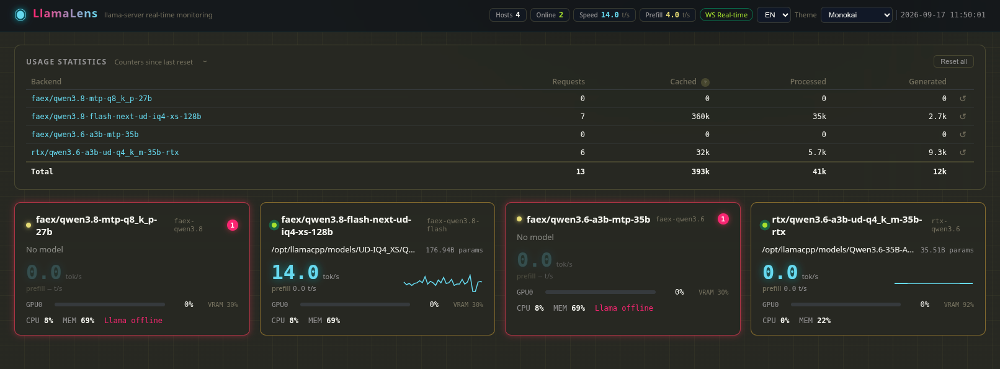

# LlamaLens

[](../README.md) [](README.ru.md)

Real-time multi-host monitoring panel for the llama.cpp `llama-server` inference backend (Chinese name: **llama灵境**).

- **Portal page** — status of every host at a glance (status / model / token speed / GPU / CPU / memory)
- **Per-host detail page** — token speed / per-GPU aggregation / CPU (per core) / memory / disk / network / processes / model / slots / event feed, 80+ data points
- **Real time** — WebSocket push every 1 s (configurable 1 s / 2 s / 5 s / pause), automatic fallback to polling on disconnect
- **Threshold alerts** — yellow / red two-level color coding, configurable per host
- **9 themes** — Aurora / Terminal / Light / Monokai / Nord / Dracula / Synthwave '84 / Tokyo Night / Matrix
- **Interface languages** — English / Русский, switchable from a compact dropdown in the top-right corner
- **Deployment** — native single process or Docker image, your choice

## ⭐ Why it deserves a star

- **Replaces a whole Prometheus + Grafana stack** — a single process / a single Docker container, tuned for llama.cpp
- **llama.cpp-native metrics** — token generation / prefill speed, context usage, MTP acceptance, slot states: what generic monitors don't give you
- **Up in 30 seconds** — `docker compose up -d --build`, open the browser, see live data
- **Zero intrusion** — read-only commands over SSH; no agents installed, nothing written to monitored hosts
- **Bonus local TUI** — `llamalens`, a single ~8 MB zero-dependency binary; SSH in and watch live
- **Actively developed** — v1.2.0 released 2026-09-17

If it saves you time, a ⭐ helps others find it.

## 📸 Screenshots

Portal page (English UI):




## Status

✅ **v1.0.0** (2026-08-29) — first release. Backend (FastAPI + SSH/HTTP collectors + WS push) and frontend (Vue 3 + ECharts) complete; `frontend/dist` is built and `./run.sh` starts the panel directly.

✅ **Docker image deployment** (2026-08-30) — multi-stage Dockerfile + docker-compose, credentials mounted at runtime, built-in health check.

✅ **v1.1.0** (2026-09-01) — local CLI (`llamalens` TUI) + offline deployment bundle + stability improvements, see "Version history".

✅ **v1.2.0** (2026-09-17) — trilingual README refresh: new top structure, badges, comparison table, localized portal screenshots.

## Documentation

| Document | Description |
|---|---|
| [README.md](../README.md) | Chinese main documentation |
| [README.en.md](README.en.md) | English main documentation (this document) |
| [README.ru.md](README.ru.md) | Russian main documentation |
| Requirements | [01-需求文档.md](01-需求文档.md) | Requirements baseline (Chinese) |
|  | [01-requirements.en.md](01-requirements.en.md) · [01-требования.ru.md](01-требования.ru.md) | Requirements translations |
| Architecture | [02-架构设计文档.md](02-架构设计文档.md) | Architecture, collectors, data model, API, deployment (Chinese) |
|  | [02-architecture.en.md](02-architecture.en.md) · [02-архитектура.ru.md](02-архитектура.ru.md) | Architecture translations |
| UI & Interaction | [03-UI与交互设计文档.md](03-UI与交互设计文档.md) | Visual spec, page layout, components, interaction (Chinese) |
|  | [03-ui-and-interaction.en.md](03-ui-and-interaction.en.md) · [03-ui-и-взаимодействие.ru.md](03-ui-и-взаимодействие.ru.md) | UI & Interaction translations |

## Tech stack

- Backend: Python 3.9+ + FastAPI + uvicorn + paramiko (read-only SSH collection)
- Frontend: Vue 3 + Vite + ECharts 5 + Vue Router
- Deployment: single process on :8000 (FastAPI serves the built frontend), native or Docker

## Monitoring target (first host)

- `ai.lan` — Qwen3.8-27B-Q6_K (27.32B) · dual RTX 3080 · llama-server :8080
- See appendix A of `01-需求文档.md`

## Requirements

| Item | Requirement | Note |
|---|---|---|
| Python | 3.9+ | Native deployment (backend runtime) |
| Node.js | 18+ | Frontend build only (not needed for Docker or when `dist` already exists) |
| Docker | 20.10+ (compose v2 included) | Docker deployment (optional) |
| Network | panel → monitored hosts | llama HTTP port (default 8080) and SSH port (default 22) must be reachable |

> The panel performs **read-only** collection against monitored hosts: llama-server HTTP polling + read-only SSH commands (ps/df/nvidia-smi/journalctl and so on). Nothing is written to the monitored hosts.

## ⚡ Quick start (result in 30 seconds)

### Option 1: native deployment

```bash
cp config/hosts.example.yaml config/hosts.yaml   # fill in host info
cp .env.example .env                             # fill in the SSH password
pip3 install -r backend/requirements.txt
cd frontend && npm install && npm run build      # build the frontend (skip if dist exists)
cd .. && ./run.sh                                # http://<this-host>:8000
```

### Option 2: Docker deployment (recommended)

```bash
cp config/hosts.example.yaml config/hosts.yaml   # fill in host info
cp .env.example .env                             # fill in the SSH password
docker compose up -d --build                     # http://<host>:8000
```

Detailed steps: see [Usage guide](#usage-guide) below (including systemd configuration on monitored hosts).

## 🆚 Comparison with alternatives

| | LlamaLens | Prometheus + Grafana | nvtop / nvidia-smi | hand-rolled curl /slots |
|---|:---:|:---:|:---:|:---:|
| llama.cpp-native metrics (token speed / MTP / slots / context) | ✅ built in | ❌ DIY exporter | ❌ | DIY parsing |
| Deployment footprint | single container / process | Prometheus + Grafana + exporters | single binary | — |
| Agent on monitored hosts | ❌ none (read-only SSH) | ✅ node_exporter etc. | local only | — |
| Per-second real-time push | ✅ WebSocket 1s | scrape interval usually ≥5s | manual refresh | manual |
| Two-level threshold coloring | ✅ | Alertmanager config | ❌ | ❌ |
| Local TUI without a browser | ✅ zero-dependency binary | ❌ | ✅ | ❌ |
| 9 themes / 3 UI languages | ✅ | ❌ | ❌ | ❌ |

## Usage guide

### 1. Configuration

#### 1.1 `.env` — credentials

```bash
cp .env.example .env
```

| Variable | Required | Description |
|---|---|---|
| `AI_SSH_PASS` | yes (example name) | SSH password, referenced in `hosts.yaml` as `${AI_SSH_PASS}`. The variable name is arbitrary — it just has to match the reference in `hosts.yaml` |
| `PORT` | no | Panel port, default 8000 |

`.env` and `config/hosts.yaml` contain sensitive information and are excluded by `.gitignore` — do not commit them.

#### 1.2 `config/hosts.yaml` — host topology

```bash
cp config/hosts.example.yaml config/hosts.yaml
```

**global**

| Field | Default | Description |
|---|---|---|
| `push_interval` | 1.0 | WS push interval (seconds) |
| `history.llama_points` | 3600 | llama series ring-buffer size (@1s, 3600 = 1h) |
| `history.host_points` | 1800 | host series ring-buffer size (@2s, 1800 = 1h) |
| `thresholds` | — | Global threshold overrides (optional, see 1.4) |

**hosts[] (per host)**

| Field | Required | Description |
|---|---|---|
| `id` | yes | Unique identifier, used in URL `/host/<id>` |
| `name` | yes | Display name |
| `llama.host` / `llama.port` | yes | llama-server address (IPv6 literals supported) |
| `llama.path` | no | Optional URL prefix for the llama-server backend (reverse-proxy scenarios). Default empty → API calls go to `http://host:port/v1/models`, `/slots`, etc. When set to e.g. `v1/llama`, calls go to `http://host:port/v1/llama/v1/models`. Empty path never produces double slashes |
| `llama.interval` | no | Poll interval for /slots (seconds), default 1.0 |
| `llama.slow_interval` | no | Poll interval for /props + /v1/models (seconds), default 30.0 |
| `llama.timeout` | no | Per-request timeout (seconds), default 3.0 |
| `ssh.host` / `ssh.port` / `ssh.user` | yes | SSH connection info |
| `ssh.password` | choose one | Password; supports `${ENV_VAR}` references into `.env` |
| `ssh.key_path` | choose one | Key file path (alternative to password; `~` expansion supported) |
| `ssh.interval` | no | Batch read-only command interval (seconds), default 2.0 |
| `ssh.keepalive` / `ssh.timeout` | no | keepalive 15s / per-command timeout 15s |
| `process.name` | no | Process name (`pgrep -x`), default llama-server |
| `systemd_unit` | no | systemd unit name, default llama-server.service |
| `log.source` | no | `journal` (systemd) or `file` (log file) |
| `log.unit` | no | Unit name (used when source=journal), default llama-server |
| `log.path` | conditional | Log file path (required when source=file) |
| `log.follow` | no | Stream-follow; when false uses 2s periodic pulls |
| `log.catchup_sec` | no | Catch-up seconds after reconnect (200 lines for file mode) |
| `disk_mounts` | no | Mount points to monitor (`df` collection), default ["/"] |
| `thresholds` | no | Per-host threshold overrides (see 1.4) |

Minimal single-host example:

```yaml
hosts:
  - id: ai
    name: AI host (ai.lan)
    llama: { host: ai.lan, port: 8080 }
    # path: v1/llama        # optional URL prefix
    ssh:
      host: ai.lan
      user: root
      password: ${AI_SSH_PASS}
    log:
      source: journal
      unit: llama-server
```

#### 1.3 Adding / removing hosts

Add or remove entries in the `hosts` list of `hosts.yaml`, then restart the service (native: re-run `./run.sh`; Docker: `docker compose restart`). No code changes needed. Each host is monitored independently — one failing host does not affect the others or the panel itself.

#### 1.4 Threshold configuration (color alerts)

Two-level color coding: yellow (warn) / red (danger). Default threshold table:

| Metric | warn | danger | Direction |
|---|---|---|---|
| gpu_util (GPU utilization) | 80 | 90 | above alerts |
| gpu_mem (VRAM) | 85 | 95 | above alerts |
| gpu_temp (GPU temperature) | 75 | 85 | above alerts |
| gpu_power (GPU power) | 85 | 95 | above alerts |
| cpu | 80 | 90 | above alerts |
| mem (memory) | 85 | 95 | above alerts |
| disk | 80 | 90 | above alerts |
| ctx (context usage) | 80 | 90 | above alerts |
| mtp (MTP acceptance) | 80 | 65 | **below** alerts |

Overrides (global or per-host, merged per field; unset fields use defaults):

```yaml
global:
  thresholds:
    gpu_util: { warn: 70, danger: 85 }
hosts:
  - id: ai
    thresholds:
      mtp: { warn: 75, danger: 60 }
```

### 2. Preparing a monitored host (llama-server systemd configuration)

The panel collects from each monitored host over three channels (all read-only); the corresponding conditions on the host side must be met for full collection:

| Channel | Collected | Host-side condition |
|---|---|---|
| llama-server HTTP API (`llama.host:llama.port`, default 8080) | `/slots` (1s), `/props`, `/v1/models` (30s): online status, slots, context, model info | llama-server listens on an address:port reachable from the panel |
| SSH batch read-only commands (2s) | CPU / memory / disk / network / GPU / processes, `systemctl show <unit>` service state | SSH reachable; process name = `process.name`; unit name = `systemd_unit` |
| SSH journal stream (`journalctl -u <unit> -f`) | Live task state, token speed, MTP acceptance, context usage | Logs go to the systemd journal (default); unit name = `log.unit` |

**Four hard conditions (all adaptable via hosts.yaml; defaults shown)**

1. **Process name matches `process.name`** (default `llama-server`): SSH collection uses `pgrep -x` exact match; when a process name exceeds 15 characters (the kernel truncates comm to 15 chars) it automatically falls back to cmdline argv[0] basename matching, so you can set the full name directly. If the binary is not called `llama-server` (e.g. `llama-server-turbo`), no rename is needed — set `process.name: llama-server-turbo` in hosts.yaml.
2. **systemd unit name matches the config**: `systemd_unit` (default `llama-server.service`, used by `systemctl show` for service state) and `log.unit` (default `llama-server`, used by `journalctl -u` for logs). If the unit is not `llama-server.service` (e.g. `my-llama.service`), change both fields to the actual unit name.
3. **llama-server listens on an address:port reachable from the panel**: the panel connects to the API across hosts, so it needs `--host 0.0.0.0 --port 8080` (or a NIC address reachable from the panel), consistent with `llama.host`/`llama.port` in hosts.yaml. If llama-server is behind a reverse proxy with a path prefix, set `llama.path` accordingly.
4. **Logs go to the journal, not redirected to a file**: systemd writes service stdout/stderr to the journal by default; `journalctl -u <unit>` reads it. If you must write to a file, use `log.source: file` + `log.path` (see end of this section).

**Configuration steps (run on the monitored host)**

1. Install llama.cpp to get the `llama-server` binary (keep the filename `llama-server`).
2. Create `/etc/systemd/system/llama-server.service` (adjust path/arguments as needed):

```ini
[Unit]
Description=llama.cpp llama-server
After=network-online.target
Wants=network-online.target

[Service]
Type=simple
User=llama
WorkingDirectory=/opt/llama.cpp
ExecStart=/opt/llama.cpp/build/bin/llama-server \
  -m /share/AI/LLM/unsloth/Qwen3.8-27B-Q6_K.gguf \
  --n-gpu-layers all \
  --ctx-size 262144 \
  --host 0.0.0.0 \
  --port 8080
Restart=always
RestartSec=5
LimitNOFILE=65536

[Install]
WantedBy=multi-user.target
```

3. Load and enable at boot:

```bash
systemctl daemon-reload
systemctl enable --now llama-server
```

**Unit file essentials**

- `ExecStart` uses the absolute binary path; inference arguments (model, GPU layers, ctx, etc.) should match reality — the panel parses the full command line automatically and shows an argument table in the process section.
- `Restart=always`: restarts automatically after a crash or reboot; the panel detects PID changes, resets the state machine and re-pulls startup logs automatically — no manual intervention.
- Do not add `StandardOutput=file:...` (it breaks journal log collection).
- `User=` is optional: a non-root runtime user needs read access to the model files; the SSH account (`ssh.user`, default root) is unrelated to the service user and only needs read-only rights.
- Security note: the llama-server API has no authentication; `--host 0.0.0.0` exposes it to the LAN. Make sure the network is trusted or restrict source IPs with a firewall.

**Verification (on the monitored host)**

```bash
systemctl status llama-server        # active (running)
pgrep -x llama-server                # prints a PID (exact process-name match)
curl http://127.0.0.1:8080/health    # {"status":"ok"}
journalctl -u llama-server -n 20     # shows "listening on http://0.0.0.0:8080"
```

> The commands above use the default names; if you customized process/unit names, substitute the values configured in hosts.yaml.

**Verification (panel side)**

```bash
curl http://<panel-host>:8000/api/health
# {"status":"ok","hosts":{"ai":{"llama_online":true,"ssh_ok":true}}}
```

`llama_online=true` means the API channel works; `ssh_ok=true` means the SSH channel (including the journal log stream) works.

**Non-systemd environments (optional)**

When systemd is unavailable (e.g. run manually in the foreground): redirect `llama-server ... >> /var/log/llama-server.log 2>&1` at startup and set `log.source: file` + `log.path: /var/log/llama-server.log` in hosts.yaml; service state (systemd unit) data is then unavailable, but processes/GPU/system metrics still work.

### 3. Deployment

#### 3.1 Native deployment

Prerequisites: Python 3.9+, Node 18+ (only needed for the first frontend build).

```bash
# 1. Install backend dependencies
pip3 install -r backend/requirements.txt

# 2. Configure
cp config/hosts.example.yaml config/hosts.yaml   # fill in host info
cp .env.example .env                             # fill in the SSH password

# 3. Build the frontend (skip if frontend/dist exists)
cd frontend && npm install && npm run build && cd ..

# 4. Start
./run.sh                                          # http://<this-host>:8000
```

- `run.sh` builds the frontend automatically when `frontend/dist` is missing
- Change port: `PORT=9000 ./run.sh`
- Logs: stdout + `logs/llamalens.log`

#### 3.2 Docker deployment

The image is built in stages (node builds the frontend → python slim runs the backend). Credentials and host topology are not baked into the image — they are mounted as read-only volumes at runtime:

```bash
# 1. Configure (same as native)
cp config/hosts.example.yaml config/hosts.yaml
cp .env.example .env

# 2. Build and start
docker compose up -d --build                     # http://<host>:8000
```

Manual equivalent:

```bash
docker build -t llamalens:latest .
docker run -d --name llamalens -p 8000:8000 \
  -v $PWD/config/hosts.yaml:/app/config/hosts.yaml:ro \
  -v $PWD/.env:/app/.env:ro \
  -v $PWD/logs:/app/logs \
  llamalens:latest
```

Offline deployment (target host without network / no build environment; export the image on a build machine):

```bash
# Build machine: export the image
docker save llamalens:latest | gzip -c > llamalens-web-<date>.tgz

# Copy to the target host (image + existing config)
scp llamalens-web-<date>.tgz config/hosts.yaml .env root@<target>:/opt/llamalens/

# Target host: load and start (mounts match the compose deployment)
docker load -i /opt/llamalens/llamalens-web-<date>.tgz
docker run -d --name llamalens --restart unless-stopped \
  -p 8000:8000 -e PORT=8000 \
  -v /opt/llamalens/config/hosts.yaml:/app/config/hosts.yaml:ro \
  -v /opt/llamalens/.env:/app/.env:ro \
  -v /opt/llamalens/logs:/app/logs \
  llamalens:latest

# Verify
docker ps                            # (healthy) after ~30s
curl -s localhost:8000/api/health
```

- Three mounts: `hosts.yaml`/`.env` read-only, `logs` persisted (same as compose)
- Restart after config changes: `docker restart llamalens` (config is mounted; no image rebuild needed)

Common operations:

```bash
docker compose logs -f llamalens     # view logs
docker compose restart               # restart (picks up config changes)
docker compose down                  # stop and remove the container
docker ps                            # check (healthy) status
```

- Change port: `-p 9000:9000` plus `-e PORT=9000` (default 8000)
- SSH key auth: mount the key into the container and point `key_path` at the in-container path (e.g. `-v ~/.ssh/id_ed25519:/secrets/id_ed25519:ro` + `key_path: /secrets/id_ed25519`)
- Logs: `docker logs llamalens`, or `logs/llamalens.log` under the mount directory
- Health check: built-in HEALTHCHECK (`/api/health`); `docker ps` shows (healthy)

### 4. Using the panel

#### 4.1 Portal page (/)

- Top brand bar: llama灵境 logo, total hosts / online count, language switcher (EN/РУ), theme switcher
- Host card wall: per card a status dot (online green pulse / offline red / SSH-down yellow), model name + parameter count, token generation speed (big number + 60s sparkline), per-GPU utilization bar, CPU / memory usage
- Over-threshold: red border + red corner badge
- Click a card to enter the detail page; the portal refreshes in real time (1s) as well

#### 4.2 Detail page (/host/:id)

Eight sections from top to bottom:

| Section | Content |
|---|---|
| TopBar | Host name, status badge (llama offline / SSH down), refresh control, theme + language switcher |
| Live overview | 4 cards: token generation speed / prompt processing speed / context usage (big number = raw token count, percentage in the top-right corner) / MTP acceptance gauge |
| GPU | Per-GPU panel: utilization gauge, VRAM used/free/total, temperature, power, fan, frequency, PCIe, P-state, driver, processes occupying the GPU |
| Live generation task | Left: state card (prompt processing (with progress) / generating (with decoded count and speed) / idle, task ID, remaining tokens, elapsed time etc.); right: event feed |
| System | CPU (model/cores/per-core bars/load 1-5-15/clock), memory (total/used/buff_cache/swap), disk (per-mount usage + read/write rates), network (per-NIC rx/tx) |
| Processes | llama-server process card (PID / CPU% / RSS / threads / uptime / systemd service state / full command line + parsed argument table) + Top 8 CPU + Top 8 memory |
| Model & Slots | Model card (name/path/ftype/params/n_ctx/capabilities etc.) + one card per slot (state/task/prompt tokens/decoded/remaining/full sampling params) |
| Trends | 12 charts in 3 groups (llama: gen speed / prefill speed / context usage / MTP acceptance; GPU: utilization / VRAM / temperature / power; system: CPU / memory / network / load), 5m/15m/1h window switch |

#### 4.3 Live refresh control

TopBar dropdown: **Live (WS) / 1s / 2s / 5s / Paused**

- Live (WS): WebSocket push (default), green indicator dot
- 1s / 2s / 5s: HTTP polling, yellow indicator dot
- Paused: stops data requests, keeps the last data + "paused" watermark, gray indicator dot
- On WS disconnect it automatically degrades to HTTP polling with a notice; auto-reconnect (1s/2s/4s backoff)

#### 4.4 Theme switching

Top-right dropdown, 9 themes: Aurora (default) / Terminal / Light / Monokai / Nord / Dracula / Synthwave '84 / Tokyo Night / Matrix. Selection is saved in the browser (localStorage) and applied instantly.

#### 4.5 Language switching

Compact dropdown in the top-right corner of both the portal and detail pages: **EN / РУ**. The entire interface — headings, labels, hints, and the event feed — switches immediately. The choice is saved in localStorage; on first visit the language is auto-detected from the browser (Russian browsers get РУ, everyone else EN). Technical terms (WS, HTTP, SSH, PID, GPU, MTP, tok/s, etc.) and theme names stay in their canonical form in both languages.

#### 4.6 Threshold color alerts

- Two-level color scale: yellow (warn) / red (danger); evaluated by the backend, rendered by the frontend per level
- Effects: number color change + card border glow + pulse animation (danger); red corner badge on portal cards
- Visual-only indication, no notifications

#### 4.7 Degradation and empty states

| State | Display |
|---|---|
| llama offline | Red TopBar badge; speed card "—" grayed out + "data as of HH:MM:SS"; GPU/system sections still work (SSH still available) |
| SSH down | Yellow TopBar badge; GPU/system/process sections show "data unavailable (SSH down)" placeholders, keep last values grayed out; live overview/task sections work (API data still available) |
| Log unavailable | Task card shows "logs unavailable, using API data"; speed falls back to /slots differential with a data-source note |
| Both down | Full-page red banner "host unreachable" |
| No GPU / no process / no slots | Corresponding section shows an empty-state hint |

### 5. Operations

#### 5.1 Logs

- Native: `logs/llamalens.log` (INFO) + uvicorn stdout
- Docker: `docker logs llamalens`, or `logs/llamalens.log` under the mount directory

#### 5.2 Health check

```bash
curl http://<host>:8000/api/health
# {"status":"ok","hosts":{"ai":{"llama_online":true,"ssh_ok":true}}}
```

#### 5.3 Troubleshooting

| Symptom | Diagnosis |
|---|---|
| SSH down (yellow badge) | Network reachability (panel → host:22), username/password/key, whether the host sshd is running; `logs/llamalens.log` has the specific error |
| llama offline (red badge) | Whether llama-server is running, whether the port is correct, whether port 8080 on the host is reachable from the panel; if llama-server is behind a proxy path, check `llama.path` |
| Logs unavailable / speed sourced from API | `log.source=journal` needs the unit name to match systemd; `source=file` needs `log.path` filled in and the file to exist |
| Port in use | Change port: `PORT=9000 ./run.sh` or `-p 9000:9000 -e PORT=9000` |
| Frontend 404 / "frontend not built" | `cd frontend && npm install && npm run build` (run.sh builds automatically) |
| Config changes not taking effect | Config is loaded at startup; restart: re-run `./run.sh` or `docker compose restart` |

### 6. API reference

| Method | Path | Description |
|---|---|---|
| GET | /api/health | Panel self-check: {status, hosts: {id: {llama_online, ssh_ok}}} |
| GET | /api/hosts | Portal: [{id, name, online, model_name, gen_speed_tps, gpus, cpu_pct, mem_pct, ...}] |
| GET | /api/hosts/{id}/overview | Full snapshot (80+ fields) |
| GET | /api/hosts/{id}/history?window=300 | History series (window seconds: 300/900/3600) |
| GET | /api/hosts/{id}/events?limit=50 | Event feed |
| WS | /ws/hosts/{id} | Snapshot push every push_interval (default 1s); client sends {"type":"ping"} heartbeat |
| WS | /ws/portal | /api/hosts data every 1s |

Interactive API docs: `http://<host>:8000/docs` (FastAPI Swagger).

## Local CLI (llamalens)

An htop-style full-screen TUI that runs **on the monitored host itself**, sourced from the same collectors/thresholds/events as the web panel's per-host detail page. Ideal for SSH-ing into the host and watching live state without opening a browser.

**Zero runtime dependencies**: a single static binary (`CGO_ENABLED=0`); the target host needs no Go / Python / pip. All data is collected locally:

| Data | Source | Period |
|---|---|---|
| Gen/prefill speed, context, MTP, slots, model | llama-server local HTTP API (`/slots`, `/props`, `/v1/models`) + journal log parsing | 1s / 30s |
| CPU / memory / disk / network / load / top processes | `/proc` direct reads | 2s |
| GPU utilization / VRAM / temperature / power / processes | `nvidia-smi` | 2s |
| Service state, log event stream | `systemctl show` + `journalctl -u <unit> -f` | 2s / streaming |

### Build (on a dev machine with Go 1.24+)

```bash
cd cli
CGO_ENABLED=0 GOOS=linux GOARCH=amd64 go build -ldflags="-s -w" -o dist/llamalens ./cmd/llamalens
```

Artifact `cli/dist/llamalens` (~8 MB, statically linked, stripped).

### Deploy to the monitored host

```bash
scp cli/dist/llamalens root@<host>:/usr/local/bin/llamalens
ssh root@<host> chmod +x /usr/local/bin/llamalens
```

### Usage

```bash
# Defaults: llama-server 127.0.0.1:8080, process name llama-server, unit llama-server, journal logs
llamalens

# Custom (process name/port/unit must match hosts.yaml)
# --process accepts full binary names (no 15-char truncation limit; falls back to cmdline match when comm fails)
llamalens --llama-port 8081 --process llama-server --unit llama-server

# llama-server behind a reverse-proxy path prefix
llamalens --llama-path v1/llama        # → http://127.0.0.1:8080/v1/llama/slots, /v1/models, ...

# Logs from a file instead of journal
llamalens --log file --log-path /var/log/llama.log

# One-shot text snapshot (non-TUI; for scripts / no-TTY environments)
llamalens --once

# Diagnose terminal display: write each rendered frame's raw bytes (incl. ANSI) to a file (overwritten each time)
# Press p to pause during reproduction and the file keeps that frame; cat -v /tmp/frame.txt to inspect raw bytes
llamalens --dump-frame /tmp/frame.txt

# Disable all colors (plain-text rendering; for diagnosing color display issues)
llamalens --no-color
```

**Keys**: `q` quit · `p` pause/resume · `t` show/hide history trend · `g` show/hide GPU section.

**Layout** (top to bottom): top bar (host/model/online/time) → live overview (token speed / prefill / context / MTP acceptance, 4 cards) → GPU (per-card aggregation) → live generation task + event feed → system resources (CPU/memory/disk/network) → model & slots + processes → history trend (8 sparklines). Threshold coloring is shared with the web panel (GPU util 80/90, VRAM 85/95, temp 75/85, CPU 80/90, disk 80/90, context 80/90, MTP <80/<65).

**Terminal requirements**: at least 80×20; interactive TTY needed (except `--once`). The terminal is restored automatically on exit (alternate screen/cursor/mouse tracking), no residue.

## Version history

| Version | Date | Description |
|---|---|---|
| v1.0.0 | 2026-08-29 | First release: multi-host real-time monitoring (portal + per-host detail), WS 1s real-time push, threshold color alerts, Top CPU precision fix (/proc stat direct reads), SSH disconnect self-healing |
| v1.1.0 | 2026-09-01 | Local CLI (llamalens TUI, zero-dependency single binary, same collectors/thresholds/events as the web); Docker offline tgz delivery; backend stability (async logging to avoid event-loop blocking, one-shot CUDA collection, WS close timeouts, 15-char process-name cmdline fallback); frontend tab-hidden pause polling; TUI fixes (GPU 0MB usage, ANSI256 red invisibility, task card state based on /slots, GPU process per-card attribution, --dump-frame/--no-color diagnostics) |
| v1.2.0 | 2026-09-17 | README refresh across all three languages: star-oriented structure (badges, why-star, 30-second quick start, alternatives comparison table, localized portal screenshots); no code changes |

---

## ⭐ Found this useful?

A star is the best way to say thanks — and it helps others find the project.

[](https://github.com/vaimr/llama-lens/stargazers)