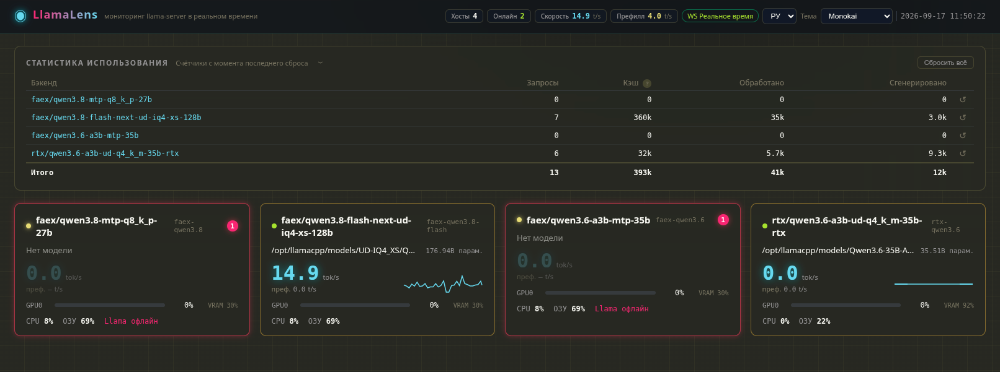

# LlamaLens

[](../README.md) [](README.en.md)

Панель мониторинга нескольких хостов в реальном времени для бэкенда вывода llama.cpp `llama-server` (китайское название: **llama灵境**).

- **Главная страница** — состояние всех хостов одним взглядом (статус / модель / скорость токенов / GPU / CPU / память)
- **Детальная страница хоста** — скорость токенов / агрегация по GPU / CPU (по ядрам) / память / диск / сеть / процессы / модель / слоты / лента событий, 80+ показателей
- **Реальное время** — WebSocket-пушинг каждую 1 с (настраивается 1 с / 2 с / 5 с / пауза), автоматическое переключение на опрос при потере связи
- **Пороговые оповещения** — двухуровневая цветовая индикация: жёлтый / красный, настраиваются на хост
- **9 тем** — Aurora / Terminal / Light / Monokai / Nord / Dracula / Synthwave '84 / Tokyo Night / Matrix
- **Интерфейс** — English / Русский, переключение компактным выпадающим списком в правом верхнем углу
- **Развёртывание** — один процесс нативно или Docker-образ, на выбор

## ⭐ Почему заслуживает звезды

- **Заменяет целый стек Prometheus + Grafana** — один процесс / один Docker-контейнер, заточенный под llama.cpp
- **Родные метрики llama.cpp** — скорость генерации/префилла токенов, использование контекста, приём MTP, состояния слотов — того, чего нет в универсальных мониторингах
- **Запуск за 30 секунд** — `docker compose up -d --build`, открыли браузер — данные в реальном времени
- **Нулевое вторжение** — только чтение по SSH; никаких агентов, ничего не записывается на мониторимые хосты
- **Бонусом локальная TUI** — `llamalens`, один бинарный файл ~8 МБ без зависимостей; зашли по SSH и смотрите
- **Активная разработка** — v1.2.0 выпущен 2026-09-17

Если проект сэкономил вам время — ⭐ поможет другим его найти.

## 📸 Скриншоты

Главная страница (русский интерфейс):




## Статус

✅ **v1.0.0** (2026-08-29) — первый релиз. Бэкенд (FastAPI + SSH/HTTP коллекторы + WebSocket-пушинг) и фронтенд (Vue 3 + ECharts) готовы; `frontend/dist` собран, `./run.sh` запускает панель напрямую.

✅ **Развёртывание Docker** (2026-08-30) — многоэтапный Dockerfile + docker-compose, учётные данные монтируются при запуске, встроенная проверка работоспособности.

✅ **v1.1.0** (2026-09-01) — локальная CLI (`llamalens` TUI) + офлайн-пакет развёртывания + улучшение стабильности, см. «История версий».

✅ **v1.2.0** (2026-09-17) — обновление README на трёх языках: новая структура верхней части, бейджи, таблица сравнения, локализованные скриншоты портала.

## Документация

| Документ | Описание |
|---|---|
| [README.md](../README.md) | Основной документ на китайском |
| [README.en.md](README.en.md) | Документация на английском |
| [README.ru.md](README.ru.md) | Полная документация на русском (этот документ) |
| Требования | [01-需求文档.md](01-需求文档.md) | Базовые требования (китайский) |
|  | [01-requirements.en.md](01-requirements.en.md) · [01-требования.ru.md](01-требования.ru.md) | Переводы требований |
| Архитектура | [02-架构设计文档.md](02-架构设计文档.md) | Архитектура, коллекторы, модель данных, API, развёртывание (китайский) |
|  | [02-architecture.en.md](02-architecture.en.md) · [02-архитектура.ru.md](02-архитектура.ru.md) | Переводы архитектуры |
| UI и взаимодействие | [03-UI与交互设计文档.md](03-UI与交互设计文档.md) | Визуальная спецификация, макеты, компоненты, взаимодействие (китайский) |
|  | [03-ui-and-interaction.en.md](03-ui-and-interaction.en.md) · [03-ui-и-взаимодействие.ru.md](03-ui-и-взаимодействие.ru.md) | Переводы UI-документа |

## Стек технологий

- Бэкенд: Python 3.9+ + FastAPI + uvicorn + paramiko (только чтение SSH)
- Фронтенд: Vue 3 + Vite + ECharts 5 + Vue Router
- Развёртывание: один процесс на :8000 (FastAPI обслуживает собранный фронтенд), нативно или Docker

## Мониторящийся хост (первый хост)

- `ai.lan` — Qwen3.8-27B-Q6_K (27.32B) · dual RTX 3080 · llama-server :8080
- См. приложение А в `01-需求文档.md`

## Требования

| Компонент | Требование | Примечание |
|---|---|---|
| Python | 3.9+ | Нативное развёртывание (бэкенд) |
| Node.js | 18+ | Только для сборки фронтенда (не нужен для Docker или при наличии `dist`) |
| Docker | 20.10+ (compose v2 включён) | Docker-развёртывание (необязательно) |
| Сеть | панель → мониторимые хосты | Порт llama (по умолчанию 8080) и SSH-порт (по умолчанию 22) должны быть доступны |

> Панель осуществляет **только чтение** с мониторимых хостов: опрос API llama-server + чтение по SSH (`ps`/`df`/`nvidia-smi`/`journalctl` и т.д.). На мониторимые хосты ничего не записывается.

## ⚡ Быстрый старт (результат за 30 секунд)

### Вариант 1: нативное развёртывание

```bash
cp config/hosts.example.yaml config/hosts.yaml   # заполните информацию о хостах
cp .env.example .env                             # заполните SSH-пароль
pip3 install -r backend/requirements.txt
cd frontend && npm install && npm run build      # соберите фронтенд (пропустите, если dist уже есть)
cd .. && ./run.sh                                # http://<this-host>:8000
```

### Вариант 2: развёртывание в Docker (рекомендуется)

```bash
cp config/hosts.example.yaml config/hosts.yaml   # заполните информацию о хостах
cp .env.example .env                             # заполните SSH-пароль
docker compose up -d --build                     # http://<host>:8000
```

Подробные шаги: см. [Руководство по использованию](#руководство-по-использованию) ниже (включая настройку systemd на мониторимых хостах).

## 🆚 Сравнение с альтернативами

| | LlamaLens | Prometheus + Grafana | nvtop / nvidia-smi | curl /slots вручную |
|---|:---:|:---:|:---:|:---:|
| Метрики llama.cpp (токены / MTP / слоты / контекст) | ✅ встроены | ❌ свой exporter | ❌ | парсите сами |
| Стоимость развёртывания | 1 контейнер / процесс | Prometheus + Grafana + exporter | 1 бинарник | — |
| Агент на мониторимом хосте | ❌ не нужен (только чтение по SSH) | ✅ node_exporter и др. | только локально | — |
| Пушинг раз в секунду | ✅ WebSocket 1s | сбор обычно ≥5s | вручную | вручную |
| Двухуровневая пороговая подсветка | ✅ | настройка Alertmanager | ❌ | ❌ |
| Локальная TUI без браузера | ✅ бинарник без зависимостей | ❌ | ✅ | ❌ |
| 9 тем / 3 языка интерфейса | ✅ | ❌ | ❌ | ❌ |

## Руководство по использованию

### 1. Конфигурация

#### 1.1 `.env` — учётные данные

```bash
cp .env.example .env
```

| Переменная | Обязательна | Описание |
|---|---|---|
| `AI_SSH_PASS` | да (имя примера) | SSH-пароль, ссылка в `hosts.yaml` как `${AI_SSH_PASS}`. Имя переменной произвольное — главное, чтобы совпадало со ссылкой в `hosts.yaml` |
| `PORT` | нет | Порт панели, по умолчанию 8000 |

`.env` и `config/hosts.yaml` содержат конфиденциальные данные и исключены из `.gitignore` — не коммитьте их.

#### 1.2 `config/hosts.yaml` — топология хостов

```bash
cp config/hosts.example.yaml config/hosts.yaml
```

**global**

| Поле | По умолчанию | Описание |
|---|---|---|
| `push_interval` | 1.0 | Интервал WebSocket-пушинга (секунды) |
| `history.llama_points` | 3600 | Размер кольцевого буфера серии llama (@1s, 3600 = 1 ч) |
| `history.host_points` | 1800 | Размер кольцевого буфера серии хоста (@2s, 1800 = 1 ч) |
| `thresholds` | — | Переопределение порогов глобально (необязательно, см. 1.4) |

**hosts[] (для каждого хоста)**

| Поле | Обязательно | Описание |
|---|---|---|
| `id` | да | Уникальный идентификатор, используется в URL `/host/<id>` |
| `name` | да | Отображаемое имя |
| `llama.host` / `llama.port` | да | Адрес llama-server (IPv6-литералы поддерживаются) |
| `llama.path` | нет | Необязательный URL-префикс для бэкенда llama-server (сценарии обратного прокси). Пусто по умолчанию → API-запросы идут на `http://host:port/v1/models`, `/slots` и т.д. При значении, например, `v1/llama` запросы идут на `http://host:port/v1/llama/v1/models`. Пустой путь никогда не даёт двойных слэшей |
| `llama.interval` | нет | Интервал опроса /slots (секунды), по умолчанию 1.0 |
| `llama.slow_interval` | нет | Интервал опроса /props + /v1/models (секунды), по умолчанию 30.0 |
| `llama.timeout` | нет | Таймаут на запрос (секунды), по умолчанию 3.0 |
| `ssh.host` / `ssh.port` / `ssh.user` | да | SSH-информация подключения |
| `ssh.password` | выберите один | Пароль; поддерживает ссылки `${ПЕРЕМЕННАЯ}` в `.env` |
| `ssh.key_path` | выберите один | Путь к файлу ключа (альтернатива паролю; поддерживается раскрытие `~`) |
| `ssh.interval` | нет | Интервал пакетных команд только для чтения (секунды), по умолчанию 2.0 |
| `ssh.keepalive` / `ssh.timeout` | нет | keepalive 15 с / таймаут на команду 15 с |
| `process.name` | нет | Имя процесса (`pgrep -x`), по умолчанию llama-server |
| `systemd_unit` | нет | Имя юнита systemd, по умолчанию llama-server.service |
| `log.source` | нет | `journal` (systemd) или `file` (файл журнала) |
| `log.unit` | нет | Имя юнита (используется при source=journal), по умолчанию llama-server |
| `log.path` | условно | Путь к файлу журнала (обязателен при source=file) |
| `log.follow` | нет | Следование потока; при false — периодическое чтение каждые 2 с |
| `log.catchup_sec` | нет | Догон после переподключения (200 строк для файлового режима) |
| `disk_mounts` | нет | Монтирования для мониторинга (`df`), по умолчанию ["/"] |
| `thresholds` | нет | Переопределение порогов на хост (см. 1.4) |

Минимальный пример одного хоста:

```yaml
hosts:
  - id: ai
    name: AI хост (ai.lan)
    llama: { host: ai.lan, port: 8080 }
    # path: v1/llama        # необязательный URL-префикс
    ssh:
      host: ai.lan
      user: root
      password: ${AI_SSH_PASS}
    log:
      source: journal
      unit: llama-server
```

#### 1.3 Добавление / удаление хостов

Добавляйте или удаляйте записи в списке `hosts` файла `hosts.yaml`, затем перезапустите службу (нативно: перезапустите `./run.sh`; Docker: `docker compose restart`). Изменение кода не требуется. Каждый хост мониторится независимо — один нерабочий хост не влияет на другие и на панель.

#### 1.4 Конфигурация порогов (цветовые оповещения)

Двухуровневая цветовая индикация: жёлтый (предупреждение) / красный (опасно). Таблица порогов по умолчанию:

| Метрика | Предупреждение | Опасно | Направление |
|---|---|---|---|
| gpu_util (загрузка GPU) | 80 | 90 | выше → оповещение |
| gpu_mem (VRAM) | 85 | 95 | выше → оповещение |
| gpu_temp (температура GPU) | 75 | 85 | выше → оповещение |
| gpu_power (питание GPU) | 85 | 95 | выше → оповещение |
| cpu | 80 | 90 | выше → оповещение |
| mem (память) | 85 | 95 | выше → оповещение |
| disk | 80 | 90 | выше → оповещение |
| ctx (использование контекста) | 80 | 90 | выше → оповещение |
| mtp (принятие MTP) | 80 | 65 | **ниже** → оповещение |

Переопределения (глобальные или на хост, объединяются по полю; незаданные поля используют значения по умолчанию):

```yaml
global:
  thresholds:
    gpu_util: { warn: 70, danger: 85 }
hosts:
  - id: ai
    thresholds:
      mtp: { warn: 75, danger: 60 }
```

### 2. Подготовка мониторимого хоста (конфигурация llama-server systemd)

Панель собирает данные с каждого мониторимого хоста по трём каналам (все только для чтения); для полного сбора необходимо выполнить соответствующие условия на хосте:

| Канал | Собирается | Условие на хосте |
|---|---|---|
| API llama-server HTTP (`llama.host:llama.port`, по умолчанию 8080) | `/slots` (1с), `/props`, `/v1/models` (30с): статус онлайн, слоты, контекст, информация о модели | llama-server слушает на адресе:порте, доступном с панели |
| SSH-команды (2с) | CPU / память / диск / сеть / GPU / процессы, `systemctl show <unit>` | SSH доступен; имя процесса = `process.name`; имя юнита = `systemd_unit` |
| SSH journal stream (`journalctl -u <unit> -f`) | Состояние задачи, скорость токенов, MTP, использование контекста | Логи идут в systemd journal (по умолчанию); имя юнита = `log.unit` |

**Четыре обязательных условия (все настраиваются через hosts.yaml; значения по умолчанию):**

1. **Имя процесса совпадает с `process.name`** (по умолчанию `llama-server`): SSH-сбор использует точное совпадение `pgrep -x`; при превышении имени процесса 15 символов (ядро обрезает comm до 15 символов) автоматически происходит переход на сопоставление по argv[0] из cmdline, поэтому можно задать полное имя напрямую. Если бинарный файл не называется `llama-server` (например, `llama-server-turbo`), переименовывать не нужно — задайте `process.name: llama-server-turbo` в hosts.yaml.
2. **Имя юнита systemd совпадает с конфигурацией**: `systemd_unit` (по умолчанию `llama-server.service`, используется `systemctl show` для состояния службы) и `log.unit` (по умолчанию `llama-server`, используется `journalctl -u` для логов). Если юнит не `llama-server.service` (например, `my-llama.service`), измените оба поля на фактическое имя юнита.
3. **llama-server слушает на адресе:порте, доступном с панели**: панель подключается к API между хостами, поэтому нужен `--host 0.0.0.0 --port 8080` (или адрес NIC, доступный с панели), согласованный с `llama.host`/`llama.port` в hosts.yaml. Если llama-server за обратным прокси с префиксом пути, укажите `llama.path`.
4. **Логи идут в journal, а не перенаправлены в файл**: systemd записывает stdout/stderr службы в journal по умолчанию; `journalctl -u <unit>` считывает его. Если нужно писать в файл, используйте `log.source: file` + `log.path` (см. конец этого раздела).

**Шаги конфигурации (выполнить на мониторимом хосте)**

1. Установите llama.cpp для получения бинарного файла `llama-server` (сохраните имя файла `llama-server`).
2. Создайте `/etc/systemd/system/llama-server.service` (скорректируйте путь/аргументы при необходимости):

```ini
[Unit]
Description=llama.cpp llama-server
After=network-online.target
Wants=network-online.target

[Service]
Type=simple
User=llama
WorkingDirectory=/opt/llama.cpp
ExecStart=/opt/llama.cpp/build/bin/llama-server \
  -m /share/AI/LLM/unsloth/Qwen3.8-27B-Q6_K.gguf \
  --n-gpu-layers all \
  --ctx-size 262144 \
  --host 0.0.0.0 \
  --port 8080
Restart=always
RestartSec=5
LimitNOFILE=65536

[Install]
WantedBy=multi-user.target
```

3. Загрузите и включите автозагрузку:

```bash
systemctl daemon-reload
systemctl enable --now llama-server
```

**Важные моменты unit-файла**

- `ExecStart` использует абсолютный путь к бинарному файлу; аргументы вывода (модель, слои GPU, контекст и т.д.) должны соответствовать реальности — панель автоматически разбирает полную команду и показывает таблицу аргументов в разделе процессов.
- `Restart=always`: автоматический перезапуск после сбоя или перезагрузки; панель обнаруживает изменение PID, сбрасывает конечный автомат и повторно вытаскивает startup-логи автоматически — без ручного вмешательства.
- Не добавляйте `StandardOutput=file:...` (это ломает сбор логов из journal).
- `User=` необязателен: непривилегированный пользователь нуждается в чтении файлов модели; SSH-аккаунт (`ssh.user`, по умолчанию root) не связан с пользователем службы и имеет только права только для чтения.
- Примечание по безопасности: API llama-server не имеет аутентификации; `--host 0.0.0.0` раскрывает его в LAN. Убедитесь, что сеть доверенная, или ограничьте IP-адреса через фаервол.

**Проверка (на мониторимом хосте)**

```bash
systemctl status llama-server        # active (running)
pgrep -x llama-server                # выводит PID (точное совпадение имени процесса)
curl http://127.0.0.1:8080/health    # {"status":"ok"}
journalctl -u llama-server -n 20     # показывает "listening on http://0.0.0.0:8080"
```

> Команды используют имена по умолчанию; если вы настроили пользовательские имена процессов/юнитов, подставьте значения из hosts.yaml.

**Проверка (со стороны панели)**

```bash
curl http://<panel-host>:8000/api/health
# {"status":"ok","hosts":{"ai":{"llama_online":true,"ssh_ok":true}}}
```

`llama_online=true` означает, что канал API работает; `ssh_ok=true` означает, что SSH-канал (включая поток журнала) работает.

**Среды без systemd (опционально)**

Когда systemd недоступен (например, запуск вручную в foreground): перенаправьте `llama-server ... >> /var/log/llama-server.log 2>&1` при старте и укажите `log.source: file` + `log.path: /var/log/llama-server.log` в hosts.yaml; данные состояния службы (юнит systemd) тогда недоступны, но метрики процессов/GPU/системы работают.

### 3. Развёртывание

#### 3.1 Нативное развёртывание

Требования: Python 3.9+, Node 18+ (нужен только для первой сборки фронтенда).

```bash
# 1. Установите зависимости бэкенда
pip3 install -r backend/requirements.txt

# 2. Конфигурация
cp config/hosts.example.yaml config/hosts.yaml   # заполните информацию о хостах
cp .env.example .env                             # заполните SSH-пароль

# 3. Соберите фронтенд (пропустите, если frontend/dist существует)
cd frontend && npm install && npm run build && cd ..

# 4. Запуск
./run.sh                                          # http://<this-host>:8000
```

- `run.sh` автоматически собирает фронтенд, когда `frontend/dist` отсутствует
- Изменение порта: `PORT=9000 ./run.sh`
- Логи: stdout + `logs/llamalens.log`

#### 3.2 Развёртывание в Docker

Образ собирается в несколько этапов (node собирает фронтенд → python slim запускает бэкенд). Учётные данные и топология хостов не зашиваются в образ — они монтируются как тома только для чтения при запуске:

```bash
# 1. Конфигурация (та же, что нативно)
cp config/hosts.example.yaml config/hosts.yaml
cp .env.example .env

# 2. Сборка и запуск
docker compose up -d --build                     # http://<host>:8000
```

Аналог вручную:

```bash
docker build -t llamalens:latest .
docker run -d --name llamalens -p 8000:8000 \
  -v $PWD/config/hosts.yaml:/app/config/hosts.yaml:ro \
  -v $PWD/.env:/app/.env:ro \
  -v $PWD/logs:/app/logs \
  llamalens:latest
```

Офлайн-развёртывание (цельный хост без сети / без среды сборки; экспортируйте образ на машине сборки):

```bash
# Машина сборки: экспортируйте образ
docker save llamalens:latest | gzip -c > llamalens-web-<date>.tgz

# Скопируйте на цельный хост (образ + существующая конфигурация)
scp llamalens-web-<date>.tgz config/hosts.yaml .env root@<target>:/opt/llamalens/

# Целевой хост: загрузите и запустите (монтирования соответствуют compose-развёртыванию)
docker load -i /opt/llamalens/llamalens-web-<date>.tgz
docker run -d --name llamalens --restart unless-stopped \
  -p 8000:8000 -e PORT=8000 \
  -v /opt/llamalens/config/hosts.yaml:/app/config/hosts.yaml:ro \
  -v /opt/llamalens/.env:/app/.env:ro \
  -v /opt/llamalens/logs:/app/logs \
  llamalens:latest

# Проверка
docker ps                            # (healthy) через ~30с
curl -s localhost:8000/api/health
```

- Три монтирования: `hosts.yaml`/`.env` только для чтения, `logs` сохраняется (как в compose)
- Перезапуск после изменений конфигурации: `docker restart llamalens` (конфигурация смонтирована, пересборка образа не нужна)

Типовые операции:

```bash
docker compose logs -f llamalens     # просмотр логов
docker compose restart               # перезапуск (подхватывает изменения конфигурации)
docker compose down                  # остановка и удаление контейнера
docker ps                            # проверка статуса (healthy)
```

- Изменение порта: `-p 9000:9000` плюс `-e PORT=9000` (по умолчанию 8000)
- SSH-аутентификация ключом: смонтируйте ключ в контейнер и укажите `key_path` на путь в контейнере (например, `-v ~/.ssh/id_ed25519:/secrets/id_ed25519:ro` + `key_path: /secrets/id_ed25519`)
- Логи: `docker logs llamalens`, или `logs/llamalens.log` под смонтированным каталогом
- Проверка работоспособности: встроенная HEALTHCHECK (`/api/health`); `docker ps` показывает (healthy)

### 4. Использование панели

#### 4.1 Главная страница (/)

- Верхняя бренд-панель: логотип llama灵境, общее количество хостов / количество онлайн, переключатель языка (EN/РУ), переключатель темы
- Стена карточек хостов: точка статуса (зелёный пульс онлайн / красный офлайн / жёлтый SSH-офф), имя модели + количество параметров, скорость генерации токенов (большая цифра + спарклайн 60с), полоса загрузки на GPU, использование CPU / памяти
- Превышение порога: красная рамка + красный угловой значок
- Нажмите на карточку для входа в детальную страницу; панель обновляется в реальном времени (1с) также

#### 4.2 Детальная страница (/host/:id)

Восемь секций сверху вниз:

| Секция | Содержание |
|---|---|
| TopBar | Имя хоста, бейдж статуса (llama офлайн / SSH офлайн), управление обновлением, переключатель темы и языка |
| Live overview | 4 карточки: скорость генерации токенов / скорость обработки промпта / использование контекста (большая цифра = сырое количество токенов, процент в правом верхнем углу) / прибор принятия MTP |
| GPU | Панель на GPU: прибор загрузки, VRAM used/free/total, температура, питание, вентилятор, частота, PCIe, P-state, драйвер, процессы, использующие GPU |
| Живая задача генерации | Слева: карточка состояния (обработка промпта (с прогрессом) / генерация (с подсчётом скорости) / ожидание, ID задачи, оставшиеся токены, прошедшее время и т.д.); справа: лента событий |
| Система | CPU (модель/ядра/полосы на ядро / нагрузка 1-5-15/час), память (total/used/buff_cache/swap), диск (использование на монтирование + скорость чтения/записи), сеть (rx/tx на NIC) |
| Процессы | Карточка процесса llama-server (PID / CPU% / RSS / потоки / uptime / состояние службы systemd / полная команда + таблица распознанных аргументов) + Топ 8 CPU + Топ 8 памяти |
| Модель и слоты | Карточка модели (имя/путь/ftype/params/n_ctx/возможности и т.д.) + карточка на слот (state/task/prompt tokens/decoded/remaining/full параметры сэмплирования) |
| Тренды | 12 графиков в 3 группах (llama: скорость генерации / скорость префилла / использование контекста / принятие MTP; GPU: загрузка / VRAM / температура / питание; система: CPU / память / сеть / нагрузка), переключение 5m/15m/1ч |

#### 4.3 Управление обновлением в реальном времени

Выпадающий список TopBar: **Live (WS) / 1с / 2с / 5с / Пауза**

- Live (WS): WebSocket-пушинг (по умолчанию), зелёная индикаторная точка
- 1с / 2с / 5с: HTTP-опрос, жёлтая индикаторная точка
- Пауза: останавливает запросы данных, сохраняет последние данные + водяной знак «пауза», серая индикаторная точка
- При потере WebSocket автоматически переходит на HTTP-опрос с уведомлением; автоматическое переподключение (backoff 1с/2с/4с)

#### 4.4 Переключение тем

Выпадающий список в правом верхнем углу, 9 тем: Aurora (по умолчанию) / Terminal / Light / Monokai / Nord / Dracula / Synthwave '84 / Tokyo Night / Matrix. Выбор сохраняется в браузере (localStorage) и применяется мгновенно.

#### 4.5 Переключение языка

Компактный выпадающий список в правом верхнем углу на главной и детальной страницах: **EN / РУ**. Весь интерфейс — заголовки, метки, подсказки и лента событий — мгновенно переключается. Выбор сохраняется в localStorage; при первом посещении язык определяется автоматически из браузера (русские браузеры получают РУ, все остальные — EN). Технические термины (WS, HTTP, SSH, PID, GPU, MTP, токенов/с и т.д.) и названия тем остаются в канонической форме на обоих языках.

#### 4.6 Цветовые оповещения порогов

- Двухуровневая цветовая шкала: жёлтый (предупреждение) / красный (опасно); оценивается бэкендом, отображается фронтендом по уровню
- Эффекты: изменение цвета числа + свечение рамки карточки + пульсация (опасно); красный угловой бейдж на карточках главной страницы
- Визуальная индикация, без уведомлений

#### 4.7 Деградация и пустые состояния

| Состояние | Отображение |
|---|---|
| llama офлайн | Красный бейдж TopBar; карточка скорости «—» серая + «данные на ЧЧ:ММ:СС»; GPU/секции системы всё ещё работают (SSH доступен) |
| SSH офлайн | Жёлтый бейдж TopBar; секции GPU/системы/процессов показывают «данные недоступны (SSH офлайн)» плейсхолдеры, сохраняют последние значения серыми; live overview/задачи работают (данные API доступны) |
| Логи недоступны | Карточка задачи показывает «логи недоступны, используются данные API»; скорость переходит к дифференциалу /slots с пометкой источника данных |
| Оба офлайн | Полноэкранная красная плашка «хост недоступен» |
| Нет GPU / нет процесса / нет слотов | Соответствующая секция показывает подсказку пустого состояния |

### 5. Эксплуатация

#### 5.1 Логи

- Нативно: `logs/llamalens.log` (INFO) + uvicorn stdout
- Docker: `docker logs llamalens`, или `logs/llamalens.log` под смонтированным каталогом

#### 5.2 Проверка работоспособности

```bash
curl http://<host>:8000/api/health
# {"status":"ok","hosts":{"ai":{"llama_online":true,"ssh_ok":true}}}
```

#### 5.3 Устранение неполадок

| Симптом | Диагностика |
|---|---|
| SSH офлайн (жёлтый бейдж) | Доступность сети (панель → хост:22), имя пользователя/пароль/ключ, работает ли sshd на хосте; `logs/llamalens.log` содержит конкретную ошибку |
| llama офлайн (красный бейдж) | Работает ли llama-server, правильный ли порт, доступен ли порт 8080 на хосте с панели; если llama-server за прокси-путём, проверьте `llama.path` |
| Логи недоступны / скорость из API | `log.source=journal` требует совпадения имени юнита с systemd; `source=file` требует заполнения `log.path` и существования файла |
| Порт занят | Смените порт: `PORT=9000 ./run.sh` или `-p 9000:9000 -e PORT=9000` |
| Фронтенд 404 / «фронтенд не собран» | `cd frontend && npm install && npm run build` (run.sh собирает автоматически) |
| Изменения конфигурации не применяются | Конфигурация загружается при запуске; перезапустите: перезапустите `./run.sh` или `docker compose restart` |

### 6. API-справочник

| Метод | Путь | Описание |
|---|---|---|
| GET | /api/health | Самостоятельная проверка панели: {status, hosts: {id: {llama_online, ssh_ok}}} |
| GET | /api/hosts | Главная: [{id, name, online, model_name, gen_speed_tps, gpus, cpu_pct, mem_pct, ...}] |
| GET | /api/hosts/{id}/overview | Полный снимок (80+ полей) |
| GET | /api/hosts/{id}/history?window=300 | История серий (окно в секундах: 300/900/3600) |
| GET | /api/hosts/{id}/events?limit=50 | Лента событий |
| WS | /ws/hosts/{id} | Снимок-пушинг каждые push_interval (по умолчанию 1с); клиент отправляет {"type":"ping"} сердцебиение |
| WS | /ws/portal | Данные /api/hosts каждые 1с |

Интерактивные API-доки: `http://<host>:8000/docs` (FastAPI Swagger).

## Локальная CLI (llamalens)

TUI на весь экран, работающий **на самом мониторимом хосте**, использующий те же коллекторы/пороги/события, что и детальная страница панели. Идеально для SSH-входа на хост и просмотра живого состояния без открытия браузера.

**Нулевые зависимости времени выполнения**: единственный статический бинарный файл (`CGO_ENABLED=0`); на целевом хосте не нужны Go / Python / pip. Все данные собираются локально:

| Данные | Источник | Период |
|---|---|---|
| Скорость генерации/префилла, контекст, MTP, слоты, модель | API llama-server локальный HTTP (`/slots`, `/props`, `/v1/models`) + парсинг journal-логов | 1с / 30с |
| CPU / память / диск / сеть / нагрузка / топ-процессы | Прямое чтение `/proc` | 2с |
| Загрузка GPU / VRAM / температура / питание / процессы | `nvidia-smi` | 2с |
| Состояние службы, поток событий логов | `systemctl show` + `journalctl -u <unit> -f` | 2с / поток |

### Сборка (на машине разработчика с Go 1.24+)

```bash
cd cli
CGO_ENABLED=0 GOOS=linux GOARCH=amd64 go build -ldflags="-s -w" -o dist/llamalens ./cmd/llamalens
```

Артефакт `cli/dist/llamalens` (~8 МБ, статически связанный, stripped).

### Развёртывание на мониторимом хосте

```bash
scp cli/dist/llamalens root@<host>:/usr/local/bin/llamalens
ssh root@<host> chmod +x /usr/local/bin/llamalens
```

### Использование

```bash
# По умолчанию: llama-server 127.0.0.1:8080, имя процесса llama-server, юнит llama-server, логи journal
llamalens

# Пользовательский (имя процесса/порт/юнит должны совпадать с hosts.yaml)
# --process принимает полные имена бинарных файлов (нет ограничения 15 символов; происходит переход к сопоставлению cmdline при неудаче comm)
llamalens --llama-port 8081 --process llama-server --unit llama-server

# llama-server за обратным прокси с префиксом пути
llamalens --llama-path v1/llama        # → http://127.0.0.1:8080/v1/llama/slots, /v1/models, ...

# Логи из файла вместо journal
llamalens --log file --log-path /var/log/llama.log

# Однопроходной текстовый снимок (не-TUI; для скриптов / сред без TTY)
llamalens --once

# Диагностика отображения терминала: записывает каждый отрендеренный кадр в виде сырых байт (вкл. ANSI) в файл (перезаписывается каждый раз)
# Нажмите p для паузы во время воспроизведения, и файл сохраняет этот кадр; cat -v /tmp/frame.txt для инспекции сырых байт
llamalens --dump-frame /tmp/frame.txt

# Отключить все цвета (текстовое отображение; для диагностики проблем с цветами)
llamalens --no-color
```

**Клавши**: `q` выход · `p` пауза/возобновить · `t` показать/скрыть тренд истории · `g` показать/скрыть секцию GPU.

**Макет** (сверху вниз): верхняя панель (хост/модель/онлайн/время) → live overview (скорость токенов / префилл / контекст / принятие MTP, 4 карточки) → GPU (агрегация на карточку) → живая задача генерации + лента событий → системные ресурсы (CPU/память/диск/сеть) → модель и слоты + процессы → тренд истории (8 спарклайнов). Цветовая индикация порогов совпадает с веб-панелью (загрузка GPU 80/90, VRAM 85/95, темп 75/85, CPU 80/90, диск 80/90, контекст 80/90, MTP <80/<65).

**Требования терминала**: минимум 80×20; интерактивный TTY нужен (кроме `--once`). Терминал автоматически восстанавливается при выходе (alternate screen/cursor/mouse tracking), никаких остатков.

## История версий

| Версия | Дата | Описание |
|---|---|---|
| v1.0.0 | 2026-08-29 | Первый релиз: мониторинг нескольких хостов в реальном времени (главная + детальная по хосту), WebSocket-пушинг 1с, цветовые пороговые оповещения, исправление точности Top CPU (прямое чтение /proc stat), самовосстановление SSH-отключения |
| v1.1.0 | 2026-09-01 | Локальная CLI (llamalens TUI, однобинарный файл без зависимостей, те же коллекторы/пороги/события, что в веб-интерфейсе); офлайн-доставка tgz через Docker; стабильность бэкенда (асинхронное логирование без блокировки event-loop, однократный сбор CUDA, таймауты WebSocket, откат 15-символьного имени процесса к cmdline); пауза опроса при скрытии вкладки; исправления TUI (GPU 0MB, невидимость ANSI256 красного, состояние задачи на основе /slots, агрегация GPU-процессов по карточкам, диагностики --dump-frame/--no-color) |
| v1.2.0 | 2026-09-17 | Обновление README на трёх языках: структура, ориентированная на звёзды (бейджи, why-star, быстрый старт за 30 секунд, таблица сравнения, локализованные скриншоты портала); без изменений кода |

---

## ⭐ Проект оказался полезным?

Звезда — лучший способ сказать «спасибо», и она помогает другим найти проект.

[](https://github.com/vaimr/llama-lens/stargazers)